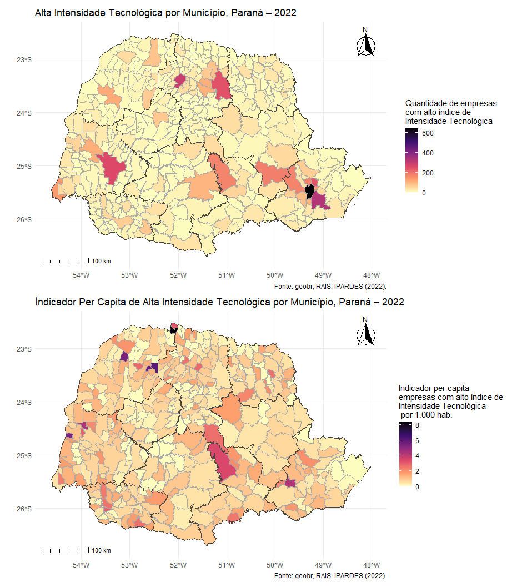

INICIAÇÃO CIENTÍFICA – 2024
---
### ic-2024
<h3>Iniciação Científica - Indicador de Concentração Tecnológica (RAIS 2022)</h3>

---

<h3># Database</h3> 

 ago-2024

---

<h3>Link Classificação OCDE</h3>

[Boletim de Indicadores Econômicos e Financeiros - Fipe, Agosto 2013](https://downloads.fipe.org.br/publicacoes/bif/bif461-8-13.pdf)

---

<h3>Mapa do Paraná - Alta Intensidade Tecnológica – 2022</h3>

---
<h2>F. Morais, 2024</h2>